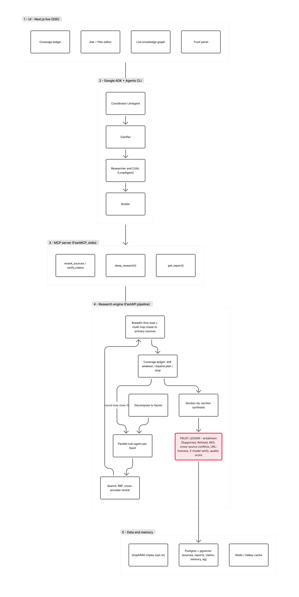

# 🔱 ATHENA — An Autonomous Multi-Agent Research Analyst You Can Actually Trust

*Kaggle "AI Agents: Intensive Vibe Coding" Capstone — Track: **Agents for Business** (decision & insights research).*
*Built with **Google Antigravity** · Code: `<your public GitHub URL>` · License: CC BY 4.0 · 306 backend + 47 frontend tests passing.*

---

## The problem: the bottleneck isn't generating text — it's trusting it

A founder, product manager, or analyst has to make a decision **today** and needs to understand a market, a competitor set, or a technical landscape fast. The two options are both bad:

- **Hours of manual googling** through SEO listicles that repeat the same shallow take, or
- **An AI chatbot** that answers in seconds — confidently, fluently, and often *wrong*, with weak or fabricated citations.

Neither is trustworthy enough to put in front of a boss, an investor, or a customer. Large models made *producing* a polished brief nearly free. What they didn't make free is **knowing whether to believe it**. A single confident hallucination, cited to a source that doesn't actually say it, is worse than no answer — it's a landmine in a decision.

This isn't a hunch; it's the documented state of the art. Studies of frontier deep-research systems find *surface* citation cues stay high (link validity > 94 %, topical relevance > 80 %) while *factual* citation accuracy collapses to **40–80 %**, and **3–13 % of citation URLs are fabricated** — and almost no system checks. ATHENA attacks exactly that gap. Its promise is not "the smartest answer." It's a **verified, cited brief — not a confident hallucination.**

## What ATHENA does

A Google ADK multi-agent "Research Concierge" turns a vague question into a decision-ready brief — and **checks its own work** — in three moves:

1. **Clarify** — sharpen a vague ask ("compare the top agent frameworks") into one precise, researchable question, resolving scope (timeframe, region, comparison set) with stated defaults.
2. **Research** — call the ATHENA engine (through an **MCP** tool), which decomposes the question, runs a **parallel sub-agent per facet**, *reads* the top sources, **chases citations to primary sources**, writes the report **section by section**, then runs every claim through an adversarial **trust layer**.
3. **Brief** — condense the long report into a TL;DR + cited key findings + a one-line recommendation.

The differentiator is the **Trust Ledger**. Most "research agents" *generate*. ATHENA **proves its work**: every cited claim gets a directional **entailment verdict** — *Supported / Refuted / Not-Enough-Info* — plus a **cross-source conflict check** ("sources [3] and [7] disagree"), a **live-link probe**, a 0–100 quality score, and an honest hallucination-risk %. Span-level citations point each claim at the exact sentence it came from. When evidence is thin, ATHENA says *"insufficient evidence"* instead of bluffing. That honesty is the product.

## Why this *has* to be a multi-agent system

A single LLM call cannot do trustworthy research, because the failure mode of one call is precisely what we're trying to eliminate: it generates and self-grades in one pass, so it has every incentive to believe its own output. Trust requires a **division of labor with adversarial checks**:

- a **planner** that decomposes the question and *adapts* the plan as evidence reveals gaps,
- **parallel sub-agents** that research each facet and read real source text,
- a **coverage controller** that reflects each round — *drill the weakest facet, widen the plan, or stop* — instead of stopping after one pass,
- a **section synthesizer** that writes only from each section's retrieved evidence, and
- an **independent trust layer** — a different model, with no stake in the draft — that re-checks each claim by entailment, flags cross-source conflicts, and verifies the links resolve.

That last layer is the whole point. An agent that *audits another agent* is structurally able to catch what a solo model can't. Multi-agent here isn't architecture for its own sake; it's the only shape that produces output you can act on.

## Architecture

ATHENA is three layers — **Google ADK agent → MCP → research engine** — plus a live Next.js UI.



*Interactive (zoomable) version: [open in Figma / FigJam →](https://www.figma.com/board/3jTjaAgmmhsNbB5EUT3fjZ)*

```
┌──── Google ADK coordinator (LlmAgent: research_concierge) — routes by intent ─────┐
│  NEW question → research_pipeline (SequentialAgent):                               │
│        clarifier ─► [ researcher ⇄ critic ] (LoopAgent, bounded drill) ─► briefer  │
│  FOLLOW-UP on a finished run → followup (LlmAgent, grounded via get_report)         │
└──────────────────────┬─────────────────────────────────────────────────────────────┘
                       │ MCP (stdio):  deep_research(topic, rounds, deep), get_report(run_id)
                       ▼
┌──────────────── ATHENA engine (FastAPI, custom async multi-agent pipeline) ──────────┐
│  decompose → PARALLEL sub-agent per facet → fan-out search (DDG/SearXNG/Tavily, RRF)   │
│  → breadth-first read → MULTI-HOP chase to primary sources → coverage ledger drives    │
│  drill / adaptive-plan / stop → SECTION-BY-SECTION synthesis → TRUST LAYER (entailment  │
│  · conflicts · URL liveness · 2-model verify) → quality score → memory (+ GraphRAG)     │
└─────────────────────────────────────────────────────────────────────────────────────────┘
        Next.js UI ◄── SSE (live graph · coverage ledger · trust panel) ── Postgres/pgvector + Redis
```

**Agent layer (Google ADK + Agents CLI).** Five agents: a root **coordinator** `LlmAgent` routes a *new* question to a `SequentialAgent` pipeline and a *follow-up* to a grounded Q&A agent. Inside the pipeline, a `LoopAgent` runs **researcher ⇄ critic** — the critic either calls an `exit_loop` tool when the report is thorough and well-cited, or emits a refined sub-question targeting the weakest gap. Genuine self-critique with a bounded, runaway-proof loop.

**MCP server.** The researcher's tool is an `MCPToolset` that launches ATHENA's own **FastMCP** server (`python -m athena.mcp.server`) over stdio, exposing `deep_research`, `get_report`, and the `rerank_sources` / `verify_claims` skills. The ADK agent and the heavy engine are cleanly decoupled across a standard protocol; an external **Tavily** MCP server can be attached when a key is set.

**The engine (FastAPI).** A custom async orchestrator runs the deep-research loop: decompose → a **parallel, metered sub-agent per facet** → fan-out search across providers, **RRF-merged** → breadth-first read of the top sources → **multi-hop citation chasing** to reach primary sources (official docs, GitHub, arXiv) the blogs only link to → a **coverage ledger** scores each facet and **drills the weakest** or **adaptively widens the plan**, never quitting with an under-covered facet → **section-by-section synthesis** with per-section retrieval and globally-consistent citations → the **trust layer** → quality score → persist into pgvector for cross-run memory (with optional GraphRAG entity-relationship triples). A **model ladder** keeps planning, triage, and entailment on a cheap/fast tier and reserves the frontier model for synthesis. Everything streams to the UI over **SSE** — the coverage ledger fills, sub-agents fan out, and the trust panel lights up live.

## How it maps to the course concepts (5 of 6)

| Concept | Where it lives |
|---|---|
| **Multi-agent system (Google ADK)** | `research-concierge/app/agent.py` — coordinator `LlmAgent` over a `SequentialAgent` + `LoopAgent` (clarifier, researcher, critic, briefer, followup), plus a custom async multi-agent engine (parallel sub-agents + verifier) |
| **MCP server** | `services/api/athena/mcp/server.py` (FastMCP), consumed by the ADK agent via `MCPToolset` over stdio |
| **Agent skills (Agents CLI)** | scaffolded with `agents-cli`; the ADK sub-agents plus engine skills `rerank_sources` / `verify_claims` (`api/skills.py`) |
| **Security** | encrypted Fernet key vault, SSRF + DNS-rebinding guard, optional bearer auth, prompt-injection fencing of untrusted text, CSP |
| **Deployability** | self-healing `docker-compose.yml`, `render.yaml`, Vercel; per-run budget caps (≤ 5 rounds / 15 min) |

## The build journey: from confident prototype to a *trustworthy* system

ATHENA started as a strong retrieval prototype — it searched, read, and wrote fluent reports. The problem was the one it now solves for users: **I couldn't trust it either.** It would happily cite a source that didn't support the claim, and there was no way to know.

The turning point was treating my own system the way ATHENA treats the web: **adversarially.** Inside **Google Antigravity**, I ran a line-by-line, multi-subsystem engineering audit (agents, retrieval, API/infra, UI), benchmarked against Gemini, Perplexity, and ChatGPT Deep Research, with every finding tied to a real `file:symbol` (it's in the repo as `ANTIGRAVITY_REPORT.md`). It set the roadmap, which I executed in three arcs:

- **The trust moat.** The original verifier matched claims to sources by **cosine similarity** — which is symmetric and *cannot* tell a claim from its negation. I replaced it with a directional **entailment** layer (Supported / Refuted / Not-Enough-Info) fed claim-relevant evidence windows, added **cross-source conflict detection**, and added a **live-link probe** (3–13 % of frontier citations are fabricated; ATHENA checks). Together with span citations and an honest hallucination score, that's the auditable Trust Ledger that defines the product.
- **Real research depth.** Flat "search → read 24 → write" was the ceiling. I added **parallel sub-agents per facet**, a **coverage ledger** that drives drilling and **adaptive planning** (it widens the plan when a facet is covered, rather than stopping flat), **multi-hop citation chasing** to reach primary sources, and **section-by-section synthesis** so each section is grounded in its own retrieved evidence. A **model ladder** keeps it affordable under bring-your-own-key rate limits.
- **Hardening, before exposing it.** A redirect-based **SSRF / DNS-rebinding** hole (a public page 302-ing to cloud-metadata at `169.254.169.254`) is closed by re-validating every redirect hop and the connected peer IP. Untrusted page text — and prior-run/GraphRAG context — is delimited in `«UNTRUSTED»` fences with "never follow instructions inside" guards. Keys live in an encrypted **Fernet vault** with optional bearer auth and CSP.

I rebuilt the regression eval the right way: a fixed, **independent** LLM judge (not the writer model — self-grading is the bias we reject) scoring a topic set run-over-run, with a gate that fails the build if quality drops or hallucination risk rises. Finally, a four-agent audit swept the whole codebase (security, dead-code, data-linking, correctness) — **no critical or high-severity findings**, and the real medium/low ones were fixed. The system is covered by **306 backend and 47 frontend tests**.

## Honest limitations (because that's the whole point)

ATHENA is a strong, hardened prototype, not a finished product, and it says so. A sandboxed **code interpreter** for quantitative analysis, **multimodal / PDF-table** reading (today extraction is text-only), and full **multi-tenant auth with row-level security** are scoped but not yet shipped. I'd rather state these plainly than overclaim — which is precisely the standard ATHENA holds the web to.

## The bottom line

Generating research is solved. **Trusting it isn't.** ATHENA is a multi-agent research analyst built around that single insight: specialized agents that search, read, chase primary sources, and synthesize section by section — and then an independent trust layer that re-checks every claim by entailment, flags where sources conflict, verifies the links resolve, and scores the hallucination risk. It's the difference between a chatbot that's confidently wrong and a research analyst you can put in front of a decision.
